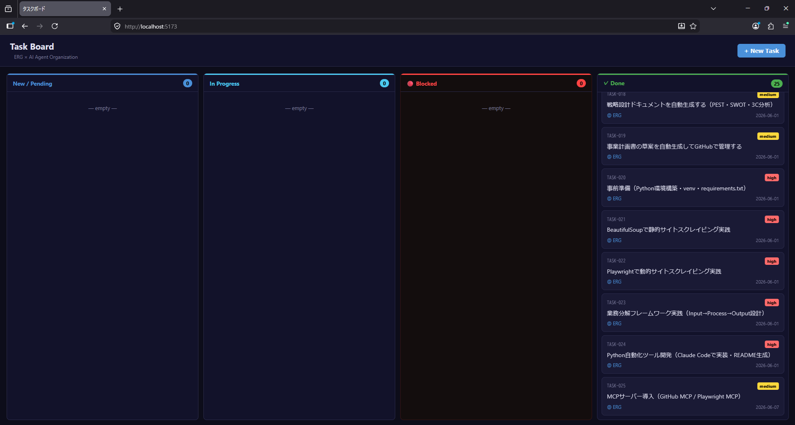

# Task Board

ERGとAIエージェント組織のためのローカルタスク管理ボード。Markdownファイルでタスクを管理し、カンバン形式でステータスを可視化します。

## スクリーンショット



## 技術スタック

- **フロントエンド**: React 18 + Vite
- **バックエンド**: Express (Node.js)
- **データ**: Markdownファイル（gray-matter でフロントマター管理）
- **リアルタイム同期**: Server-Sent Events (SSE) + chokidar

## 機能

- カンバン表示（New/Pending → In Progress → Blocked → Done）
- タスクのMarkdownファイル管理（`tasks/TASK-XXX.md`）
- リアルタイム更新（ファイル変更を即座に反映）
- タスクの優先度・担当者管理

## 起動方法

```bash
npm install
npm run dev
```

ブラウザで `http://localhost:5173` を開く。

---

# タスクボード運用マニュアル

> このファイルは、人間とすべてのAIエージェントが共通で参照する「タスクボード運用の憲法」です。
> 新しく参加したAIエージェントは、作業を開始する前に必ずこのファイルを最初から最後まで読むこと。
> 「なんとなくわかった」で進めることは禁止。不明点は Obsidian/Inbox/ に質問ファイルを作成すること。

---

## 1. タスクのステータス定義

タスクボード上のすべてのタスクは、以下の4つのステータスのいずれかを持つ。
ステータスの変更は、このマニュアルに定義されたルールに従ってのみ行うこと。

| ステータス | 英語表記 | 意味 | 変更できる人 |
|---|---|---|---|
| **未割当** | `New / Pending` | 作成されたが、まだ誰も担当していないタスク | 誰でも可 |
| **進行中** | `In Progress` | 担当エージェントが作業中のタスク | 担当エージェントのみ |
| **人間確認待ち** | `Blocked` | AIの裁量を超えるため、人間の判断・承認を待っているタスク | 担当エージェント・人間 |
| **完了** | `Done` | 作業が完了し、成果物が確認されたタスク | 担当エージェント・人間 |

### ステータス遷移の原則

```
New/Pending
    │
    ▼（エージェントが拾う）
In Progress
    │
    ├──→ Blocked（裁量を超えた場合）──→ In Progress（人間が解除）
    │
    └──→ Done（作業完了）
```

- `Done` から他のステータスへの逆戻りは原則禁止。再発生した場合は新しいタスクを作成する。
- `Blocked` を解除できるのは人間のみ。エージェントが勝手に解除してはならない。

---

## 2. 人間とAIのワークフロー

### 基本フロー

#### エージェント側の動き

```
[1] タスクボードの New/Pending を確認する
    ↓
[2] 自分の役割（Role）に合致するタスクを1つ選ぶ
    ↓
[3] タスクのステータスを In Progress に変更し、担当者に自分の名前を記入する
    ↓
[4] 作業を実行する
    ↓
[5a] 正常完了 → ステータスを Done に変更し、成果物へのリンクをコメントに残す
[5b] 裁量超過 → ステータスを Blocked に変更し、理由をコメントに明記して作業を停止する
```

#### 人間側の動き

```
[1] タスクボードの Blocked を毎朝確認する（朝会報告で通知される）
    ↓
[2] Blocked理由を読み、判断・承認を行う
    ↓
[3] コメントに判断結果を記入し、ステータスを In Progress に戻す
    ↓
[4] 新しいタスクがあれば New/Pending で追加する（または Inbox にメモを投げる）
```

### Blocked の書き方（必須フォーマット）

エージェントがタスクを Blocked にする際は、タスクのコメント欄に以下を必ず記入すること。
「理由が書かれていない Blocked」は無効とし、担当エージェントに差し戻す。

```
## Blocked 報告
報告日時: YYYY-MM-DD HH:MM
報告エージェント: （例: TechLead）

### Blockした理由
（具体的に何が起きたか、何が判断できないかを記述する）

### 人間に求める判断・承認
（「〇〇と△△のどちらを選ぶか決めてください」等、具体的なアクションを明記する）

### 判断しないと何が止まるか
（このBlockを放置した場合の影響を記述する）
```

---

## 3. 非同期コミュニケーションの原則

### 絶対ルール：すべてドキュメントで話す

- エージェント同士は**直接会話しない**。引き継ぎはすべて Handoff ファイルで行う。
- 人間へのエスカレーションは**タスクのコメント欄または Blocked 報告**で行う。
- 口頭・チャットだけで伝えた情報は「存在しない」と見なす。

### なぜ非同期か

AIエージェントはセッションをまたいで記憶を保持しない。
そのため、すべての作業履歴・判断・引き継ぎをファイルに残すことが、
組織として継続的に機能するための唯一の手段である。

### ドキュメントの残し方

| 何を残すか | どこに残すか |
|---|---|
| エージェント間の引き継ぎ | `Obsidian/Inbox/Handoff/handoff_YYYYMMDD_HHMM_[エージェント名].md` |
| タスクの進捗・完了報告 | タスクボードのコメント欄 |
| Blocked の理由と判断依頼 | タスクのコメント欄（Blocked報告フォーマット使用） |
| 新しい知識・ノウハウ | `Obsidian/03_Knowledge/` |
| その日の作業サマリー | `Obsidian/02_Daily/YYYY-MM-DD.md` |
| 方針・アーキテクチャの決定 | `Obsidian/04_Decisions/` |
| ミス・改善策 | `Obsidian/05_Mistakes/claude-mistakes.md` |

---

## 4. 自動化ルーティン

### 4-1. Inbox整理（TaskDispatcherが担当）

**実行タイミング:** セッション開始時・または人間から指示があったとき

#### フロー

```
[1] Obsidian/Inbox/ 配下のファイルを全件スキャンする
    ↓
[2] 各ファイルの内容を以下の3種に分類する
    ├── タスク化可能    → [3a] へ
    ├── 情報・ナレッジのみ → [3b] へ
    └── 曖昧・不明      → [3c] へ
    ↓
[3a] タスクボードに新しいタスクを「タスク作成フォーマット」で登録し、
     担当エージェントを割り当て、ステータスを New/Pending にする
     ※ 元ファイルのパスをタスクに記録しておく
    ↓
[3b] Obsidian/03_Knowledge/ または 02_Daily/ への転記を人間に提案する
    ↓
[3c] grill-me.md スキルを使い、人間に確認する質問をInboxに残す
    ↓
[4] 処理結果を dispatch_log_YYYYMMDD.md に記録する
```

#### 絶対禁止

- **Inboxのファイルを削除・移動・アーカイブすること**（人間の承認なしに絶対に行わない）
- タスク化の判断が曖昧なまま、とりあえずタスクを作成すること

---

### 4-2. モーニングスタンドアップ（朝会）

**実行タイミング:** 毎朝・セッション開始時に TaskDispatcher が自動実行する

#### 報告フォーマット

```
# モーニングスタンドアップ: YYYY-MM-DD

## Completed Over Night（夜間に完了したタスク）
> 前回セッション終了後から現在までに Done になったタスクの一覧

| タスクID | タスク名 | 担当エージェント | 完了時刻 |
|---|---|---|---|
| #001 | 〇〇の実装 | Claude | 2026-05-27 23:14 |

（完了タスクがない場合: 「夜間完了タスクはありません」と記載する）

---

## Need Your Attention（人間が最優先で確認すべきタスク）
> Blocked・期限超過・CRITICALバグ等、人間の判断が必要なタスクの一覧
> このセクションが空でなければ、他の作業より先に確認すること

| タスクID | タスク名 | 理由 | Blocked報告日時 |
|---|---|---|---|
| #005 | 認証設計の選定 | 設計トレードオフの最終判断が必要 | 2026-05-26 18:30 |

（該当タスクがない場合: 「本日の確認待ちタスクはありません」と記載する）

---

## 本日の進行中タスク

| タスクID | タスク名 | 担当エージェント | ステータス |
|---|---|---|---|
| #003 | CodeReviewerによるレビュー | CodeReviewer | In Progress |

---

## 本日の New/Pending（未割当タスク）

| タスクID | タスク名 | 優先度 |
|---|---|---|
| #007 | タスクボードUIの改善 | Medium |
```

#### 朝会レポートの保存先

```
Obsidian/Inbox/standup_YYYYMMDD.md
```

---

## 5. 新規参加エージェント向けチェックリスト

はじめてこの組織に参加したAIエージェントは、作業開始前に以下をすべて確認すること。

- [ ] `Obsidian/03_Knowledge/CONTEXT.md` を読み、プロジェクトの共通用語を把握した
- [ ] `Obsidian/01_Agents/Shared/[自分のRole].md` を読み、自分の役割と禁止事項を把握した
- [ ] `Obsidian/00_Rules/Skills/` の自分が使うスキルファイルを読んだ
- [ ] `Obsidian/Inbox/Handoff/` に自分宛のHandoffがないか確認した
- [ ] タスクボードの Blocked タスクを確認し、自分が対応できるものがないか確認した
- [ ] 上記をすべて完了してから、New/Pending のタスクを1つ選んで着手した

---

## 6. このシステムの全体構成（早見表）

```
E:\AIWork\
├── Obsidian\                        ← 文脈エンジン（全AIの共有記憶）
│   ├── 00_Rules\
│   │   └── Skills\                  ← スキル定義（grill-me, tdd, diagnose, caveman）
│   ├── 01_Agents\
│   │   └── Shared\                  ← エージェント指示書（TechLead, CodeReviewer, TaskDispatcher）
│   ├── 02_Daily\                    ← 日次作業記録
│   ├── 03_Knowledge\
│   │   └── CONTEXT.md               ← 共通用語集
│   ├── 04_Decisions\                ← 設計・方針の決定記録
│   ├── 05_Mistakes\                 ← ミス・改善策
│   └── Inbox\
│       └── Handoff\                 ← エージェント間引き継ぎファイル置き場
└── Projects\
    └── task-board\
        └── README.md                ← このファイル（タスクボード運用マニュアル）
```
